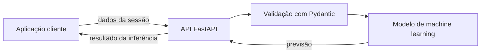

# Behavior Engineering

> Projeto em estágio inicial para desenvolver uma API de inferência de machine learning sobre intenção de compra em sessões de e-commerce.

## Visão do projeto

O objetivo é usar dados de navegação de lojas virtuais para estimar se uma sessão tem intenção de compra (`Revenue`). A API deverá receber características de uma sessão e retornar uma previsão produzida por um modelo treinado.

*Fluxo pretendido; os componentes de inferência ainda estão em desenvolvimento.*

## Dados

O projeto inclui arquivos CSV relacionados ao conjunto **Online Shoppers Purchasing Intention**. Cada registro descreve uma sessão com atributos como atividade de navegação, duração, origem do tráfego e tipo de visitante. `Revenue` indica se houve compra.

| Arquivo | Uso previsto |
| --- | --- |
| `data/online_shoppers_intention.csv` | Base para exploração e desenvolvimento |
| `notebooks/eda.ipynb` | Exploração dos dados |

## Tecnologias

| Tecnologia | Papel no projeto |
| --- | --- |
| Python 3.12+ | Linguagem da aplicação |
| FastAPI | Base para a futura API HTTP |
| Pydantic | Validação dos dados de entrada e saída |
| Joblib | Persistência e carregamento de artefatos do modelo |
| MLflow | Apoio ao acompanhamento de experimentos |
| pytest e Ruff | Testes e qualidade de código |

## Estado atual

Este repositório está no início: os dados e o notebook de exploração estão presentes, e as dependências para API, modelos e desenvolvimento estão declaradas. A implementação da API, o treinamento do modelo e os testes ainda são próximos passos.
